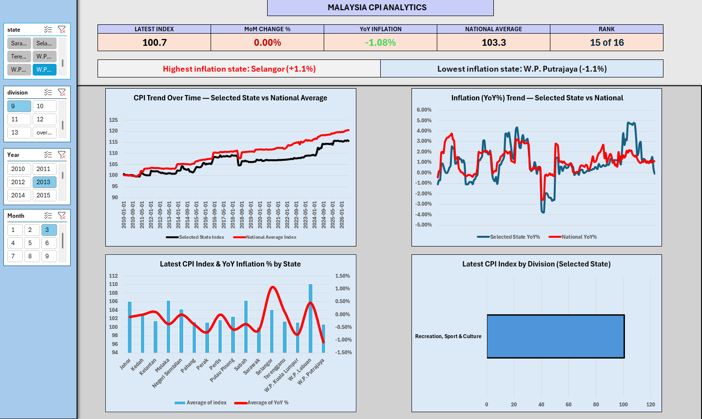

# Malaysia-CPI-Interactive-Dashboard
Interactive Malaysia Consumer Price Index dashboard developed using Microsoft Excel.
This project presents an interactive Microsoft Excel dashboard
for analysing Malaysia's Consumer Price Index (CPI) and inflation data.

## Tools Used

- Microsoft Excel
- PivotTables
- PivotCharts
- VLOOKUP
- Data Cleaning
- Data Visualisation
- Dashboard Design

## Dashboard Preview

## Analysis

The dashboard allows users to analyse:

- Inflation by state
- Inflation by division
- Highest inflation
- Lowest inflation
- Inflation trends over time
